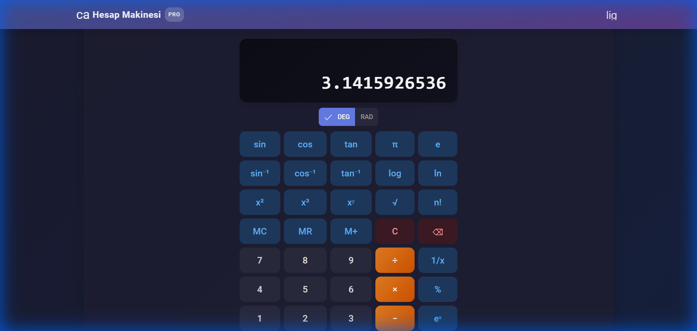
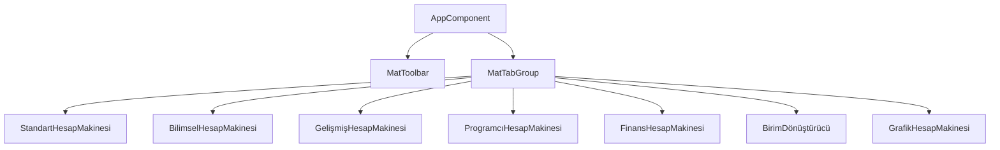

<p align="center">
  
</p>

<h1 align="center">🧮 Angular Hesap Makinesi Pro</h1>

<p align="center">
  <strong>Profesyonel Çok Modlu Hesap Makinesi Uygulaması</strong><br>
  Angular 19 • Material Design 3 • TypeScript
</p>

<p align="center">
  
  
  
  
</p>

<p align="center">
  
  
  
</p>

---

## 📖 İçindekiler

- [Genel Bakış](#-genel-bakış)
- [Özellikler](#-özellikler)
- [Ekran Görüntüleri](#-ekran-görüntüleri)
- [Teknoloji Yığını](#-teknoloji-yığını)
- [Mimari](#-mimari)
- [Kurulum](#-kurulum)
- [Kullanım](#-kullanım)
- [Hesap Makinesi Modları](#-hesap-makinesi-modları)
- [Klavye Kısayolları](#-klavye-kısayolları)
- [Durum Yönetimi](#-durum-yönetimi)
- [Tema](#-tema)
- [Proje Yapısı](#-proje-yapısı)
- [Yol Haritası](#-yol-haritası)

---

## 🌟 Genel Bakış

**Angular Hesap Makinesi Pro**, günlük ve bilimsel hesaplama ihtiyaçları için tasarlanmış profesyonel, üretime hazır çok modlu bir hesap makinesi web uygulamasıdır. En son Angular 19 standalone bileşen mimarisi ve Material Design 3 ile inşa edilmiş olup, kesintisiz tema geçişi ve responsive tasarım sunan şık, modern bir arayüze sahiptir.

### Neden Bu Hesap Makinesi?

| Özellik | Fayda |
|---------|-------|
| 🎯 **Çok Modlu** | Standart, Bilimsel, Gelişmiş, Programcı, Finans, Birim ve Grafik modları |
| 💾 **Oturum Kalıcılığı** | Hesaplamalarınız sayfa yenilemelerinde korunur |
| 🌙 **Tema Desteği** | Açık ve koyu temalar arasında kolay geçiş |
| ⌨️ **Klavye Dostu** | İleri kullanıcılar için tam klavye giriş desteği |
| 📱 **Responsive** | Mobil, tablet ve masaüstünde mükemmel çalışır |
| ♿ **Erişilebilir** | ARIA etiketleri ve klavye navigasyonu |

---

## ✨ Özellikler

### Temel Özellikler

- ✅ **Yedi Hesap Makinesi Modu** - Standart, Bilimsel, Gelişmiş, Programcı, Finans, Birim, Grafik
- ✅ **Gerçek Zamanlı Hesaplamalar** - Reaktif güncellemelerle anında sonuçlar
- ✅ **Hesaplama Geçmişi** - Önceki hesaplamaları takip edin ve geri yükleyin
- ✅ **Bellek İşlemleri** - MC, MR, M+, M- işlevselliği
- ✅ **İfade Ayrıştırıcı** - Parantezli karmaşık ifadeleri değerlendirin

### Kullanıcı Deneyimi

- 🌓 **Koyu/Açık Tema** - Sistem tercihi algılama + manuel geçiş
- 📱 **Responsive Tasarım** - Tüm ekran boyutları için optimize edilmiş
- 🎨 **Modern Arayüz** - Glassmorphism, gradientler, akıcı animasyonlar
- ⌨️ **Klavye Desteği** - Hesaplamaları doğal şekilde yazın
- ♿ **Erişilebilirlik** - Ekran okuyucu uyumlu, ARIA etiketleri

### Teknik Mükemmellik

- 🔥 **Angular 19** - En son standalone bileşen mimarisi
- 📊 **Angular Signals** - Modern reaktif durum yönetimi
- 🎭 **Material Design 3** - Google'ın en son tasarım sistemi
- 💾 **Session Storage** - Yenilemeler arasında veri kalıcı, tarayıcı kapandığında silinir
- 🏗️ **Modüler Mimari** - Yeni hesap makinesi modlarıyla kolayca genişletilebilir

---

## 📸 Ekran Görüntüleri

<p align="center">
  
</p>

<p align="center">
  <em>Bilimsel Hesap Makinesi (Koyu Tema)</em>
</p>

### Tema Karşılaştırması

| Açık Tema | Koyu Tema |
|-----------|-----------|
| Temiz, minimal tasarım | Derin lacivert gradientler |
| Yüksek kontrastlı metin | Canlı turuncu vurgular |
| İnce gölgeler | Parlayan buton efektleri |

---

## 🛠 Teknoloji Yığını

### Frontend Framework
```
Angular 19.0.0
├── Standalone Bileşenler
├── Angular Signals
├── Zoneless Değişiklik Algılama (opsiyonel)
└── Yeni Kontrol Akışı (@if, @for)
```

### UI Framework
```
Angular Material 19.0.0
├── Material Design 3
├── Özel Tema
├── Bileşen Kütüphanesi
└── Tipografi Sistemi
```

### Diller ve Stil
```
TypeScript 5.6
├── Strict Mod
├── Güçlü Tipleme
└── Modern ES Özellikleri

SCSS
├── CSS Özel Özellikleri
├── Mixin'ler ve Değişkenler
└── Responsive Breakpoint'ler
```

---

## 🏛 Mimari

### Tasarım Prensipleri

1. **Endişelerin Ayrılması** - Mantık, UI ve durum açıkça ayrılmıştır
2. **Tek Sorumluluk** - Her servis/bileşenin bir görevi vardır
3. **DRY (Kendini Tekrarlama)** - Paylaşılan bileşenler ve yardımcı programlar
4. **Açık/Kapalı Prensibi** - Mevcut kodu değiştirmeden kolayca genişletilebilir

### Bileşen Hiyerarşisi



### Servis Mimarisi

| Servis | Sorumluluk |
|--------|------------|
| `CalculationEngineService` | Tüm matematiksel işlemler |
| `CalculatorStateService` | Signals ile merkezi durum |
| `StorageService` | sessionStorage kalıcılığı |
| `ThemeService` | Koyu/Açık tema yönetimi |
| `I18nService` | Çoklu dil desteği (TR/EN/DE) |

---

## 🚀 Kurulum

### Gereksinimler

- **Node.js** 18.19 veya üstü (LTS önerilir)
- **npm** 9.0 veya üstü
- **Angular CLI** 19.0 (opsiyonel, geliştirme için)

### Hızlı Başlangıç

```bash
# Depoyu klonla
git clone https://github.com/utkumertgecgel/web-kapsamli-hesap-makinesi.git
cd web-kapsamli-hesap-makinesi

# Bağımlılıkları yükle
npm install

# Geliştirme sunucusunu başlat
npm run start

# Tarayıcıda aç
# http://localhost:4200
```

### Üretim için Derleme

```bash
# Üretim derlemesi
npm run build

# Çıktı: dist/angular-calculator/
```

---

## 📖 Kullanım

### Temel Kullanım

1. **Mod Seç** - Sekmeler arasında geçiş yapın
2. **Sayı Gir** - Butonlara tıklayın veya klavye kullanın
3. **İşlem Seç** - Operatör butonlarına tıklayın (+, −, ×, ÷)
4. **Sonuç Al** - = veya Enter'a basın

### Örnek Hesaplamalar

```
Standart:   25 × 4 = 100
Bilimsel:   sin(90°) = 1
Gelişmiş:   (5 + 3) × 2 - 4 = 12
Programcı:  255 (DEC) = FF (HEX) = 11111111 (BIN)
Finans:     100.000₺ kredi, %24 faiz, 12 ay = 9.455,96₺/ay
```

---

## 🧮 Hesap Makinesi Modları

### 1. Standart Mod

Temel işlemlerle klasik hesap makinesi.

| Buton | İşlev |
|-------|-------|
| `0-9` | Sayı girişi |
| `+` `-` `×` `÷` | Temel işlemler |
| `%` | Yüzde |
| `±` | İşaret değiştir |
| `C` | Tümünü temizle |
| `CE` | Girişi temizle |
| `=` | Hesapla |

### 2. Bilimsel Mod

Gelişmiş hesaplamalar için genişletilmiş fonksiyonlar.

| Kategori | Fonksiyonlar |
|----------|-------------|
| **Trigonometri** | sin, cos, tan, sin⁻¹, cos⁻¹, tan⁻¹ |
| **Logaritma** | log (10 tabanı), ln (doğal) |
| **Üs** | x², x³, xʸ, √, eˣ |
| **Diğer** | n!, 1/x, π, e |

### 3. Programcı Modu

Yazılımcılar için sayı sistemi dönüşümleri ve bit işlemleri.

| Özellik | Açıklama |
|---------|----------|
| **Sayı Sistemleri** | Binary, Octal, Decimal, Hexadecimal |
| **Kelime Boyutu** | BYTE, WORD, DWORD, QWORD |
| **Bitwise İşlemler** | AND, OR, XOR, NOT, shifts, rotations |
| **Complement** | 1's complement, 2's complement |

### 4. Finans Modu

Finansal hesaplamalar için özel araçlar.

| Hesaplayıcı | Özellikler |
|-------------|-----------|
| **Kredi** | EMI, toplam ödeme, ödeme planı |
| **Bileşik Faiz** | Yıllık/aylık/günlük faizlendirme |
| **SIP** | Düzenli yatırım getirisi |
| **Vadeli Mevduat** | Vade sonu hesaplaması |

### 5. Birim Dönüştürücü

8 kategori, 50+ birim.

| Kategori | Birimler |
|----------|----------|
| Uzunluk | m, km, cm, mm, mi, ft, in, yd |
| Ağırlık | kg, g, mg, lb, oz, ton |
| Sıcaklık | °C, °F, K |
| Hacim | L, mL, m³, gal, qt, pt |
| Alan | m², km², ha, acre, ft² |
| Veri | B, KB, MB, GB, TB |
| Hız | km/h, mph, m/s, knot |
| Zaman | s, min, h, gün, hafta, ay, yıl |

### 6. Grafik Modu

Matematiksel fonksiyon çizici.

| Özellik | Açıklama |
|---------|----------|
| Fonksiyon Girişi | y = f(x) formatında |
| Çoklu Fonksiyon | Birden fazla grafik overlay |
| Etkileşim | Mouse ile pan ve zoom |
| Presetler | sin, cos, x², log, sqrt vb. |

---

## ⌨️ Klavye Kısayolları

| Tuş | İşlem |
|-----|-------|
| `0-9` | Rakam gir |
| `.` veya `,` | Ondalık nokta |
| `+` | Toplama |
| `-` | Çıkarma |
| `*` | Çarpma |
| `/` | Bölme |
| `^` | Üs (Bilimsel/Gelişmiş) |
| `Enter` veya `=` | Hesapla |
| `Backspace` | Son rakamı sil |
| `Escape` | Tümünü temizle |
| `Delete` | Girişi temizle |

---

## 📊 Durum Yönetimi

### Angular Signals Mimarisi

```typescript
// Signals ile reaktif durum
private readonly _currentValue = signal<string>('0');
private readonly _operator = signal<string | null>(null);
private readonly _memory = signal<number>(0);

// Hesaplanmış değerler
readonly displayValue = computed(() => this.formatDisplay(this._currentValue()));
readonly hasMemory = computed(() => this._memory() !== 0);

// Effects ile otomatik kalıcılık
effect(() => {
  this.storageService.saveState({
    currentValue: this._currentValue(),
    operator: this._operator(),
    // ... diğer durum
  });
});
```

### Kalıcılık Stratejisi

| Depolama Türü | Davranış |
|---------------|----------|
| `sessionStorage` | Oturum boyunca kalıcı |
| Sayfa Yenileme | ✅ Veri korunur |
| Sekme Kapatma | ❌ Veri silinir |
| Tarayıcı Kapatma | ❌ Veri silinir |

---

## 🎨 Tema

### Tema Değiştirme

Araç çubuğundaki güneş/ay ikonuna tıklayarak temalar arasında geçiş yapın.

### CSS Özel Özellikleri

```scss
// Açık Tema
html {
  --calc-bg: linear-gradient(135deg, #f5f7fa 0%, #e4e8f0 100%);
  --calc-number-bg: #f0f0f5;
  --calc-operator-bg: linear-gradient(135deg, #ff9800, #f57c00);
}

// Koyu Tema
.dark-theme {
  --calc-bg: linear-gradient(135deg, #0f0f1a 0%, #1a1a2e 100%);
  --calc-number-bg: #2a2a3e;
}
```

---

## 📁 Proje Yapısı

```
angular-calculator/
├── 📂 src/
│   ├── 📂 app/
│   │   ├── 📂 core/services/           # Temel servisler
│   │   │   ├── 📄 calculation-engine.service.ts
│   │   │   ├── 📄 calculator-state.service.ts
│   │   │   ├── 📄 storage.service.ts
│   │   │   ├── 📄 theme.service.ts
│   │   │   └── 📄 i18n.service.ts
│   │   │
│   │   ├── 📂 shared/components/       # Paylaşılan bileşenler
│   │   │   ├── 📂 calculator-button/
│   │   │   ├── 📂 calculator-display/
│   │   │   └── 📂 history-panel/
│   │   │
│   │   ├── 📂 features/                # Özellik modülleri
│   │   │   ├── 📂 standard-calculator/
│   │   │   ├── 📂 scientific-calculator/
│   │   │   ├── 📂 advanced-calculator/
│   │   │   ├── 📂 programmer-calculator/
│   │   │   ├── 📂 financial-calculator/
│   │   │   ├── 📂 unit-converter/
│   │   │   └── 📂 graph-calculator/
│   │   │
│   │   └── 📄 app.component.ts         # Kök bileşen
│   │
│   ├── 📄 index.html
│   ├── 📄 main.ts
│   └── 📄 styles.scss
│
├── 📂 public/
│   ├── 📄 manifest.webmanifest         # PWA manifest
│   └── 📄 sw.js                        # Service Worker
│
└── 📄 README.md
```

---

## 🗺 Yol Haritası

### Versiyon 2.1 (Planlanan)

- [ ] Dil değiştirici UI
- [ ] Ses efektleri
- [ ] Haptic geri bildirim
- [ ] Özel temalar

### Versiyon 3.0 (Vizyon)

- [ ] Bulut senkronizasyon
- [ ] Özel formüller
- [ ] Paylaşım linki
- [ ] CSV/PDF dışa aktarma

---

## 📄 Lisans

Bu proje **özel**dir ve halka açık kullanım için lisanslanmamıştır.

---

## 👤 Geliştirici

Angular 19 ve ❤️ ile geliştirildi

---

<p align="center">
  <strong>Angular Hesap Makinesi Pro</strong><br>
  <sub>Profesyonel. Güçlü. Güzel.</sub>
</p>
