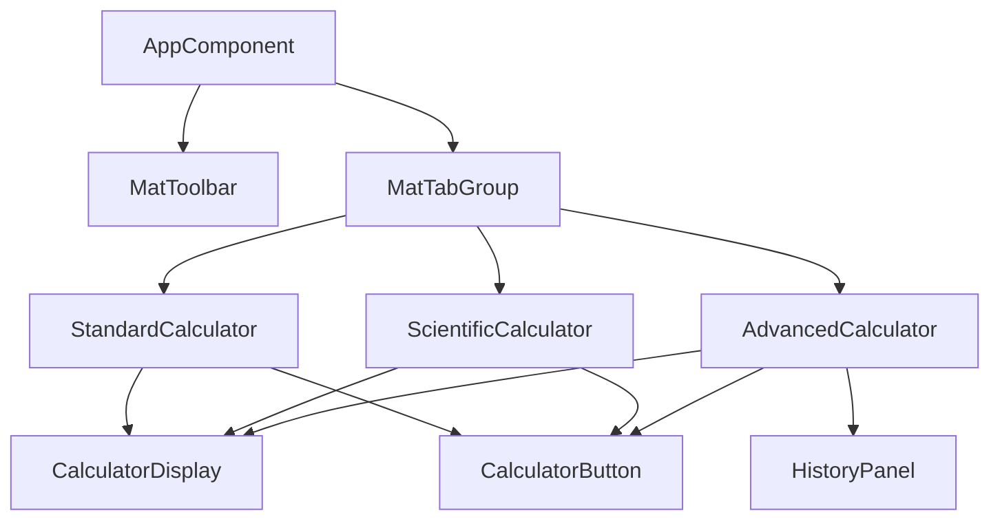
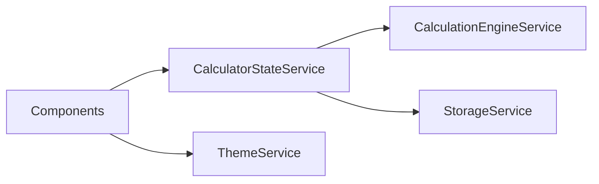

<p align="center">
  
</p>

<h1 align="center">🧮 Angular Calculator Pro</h1>

<p align="center">
  <strong>Professional Multi-Mode Calculator Application</strong><br>
  Built with Angular 19 • Material Design 3 • TypeScript
</p>

<p align="center">
  
  
  
  
</p>

<p align="center">
  
  
  
</p>

---

## 📖 Table of Contents

- [Overview](#-overview)
- [Features](#-features)
- [Screenshots](#-screenshots)
- [Technology Stack](#-technology-stack)
- [Architecture](#-architecture)
- [Installation](#-installation)
- [Usage](#-usage)
- [Calculator Modes](#-calculator-modes)
- [Keyboard Shortcuts](#-keyboard-shortcuts)
- [State Management](#-state-management)
- [Theming](#-theming)
- [Project Structure](#-project-structure)
- [Contributing](#-contributing)
- [Roadmap](#-roadmap)
- [License](#-license)

---

## 🌟 Overview

**Angular Calculator Pro** is a professional, production-ready multi-mode calculator web application designed for both everyday and scientific computation needs. Built with the latest Angular 19 standalone component architecture and Material Design 3, it offers a sleek, modern interface with seamless theme switching and responsive design.

### Why This Calculator?

| Feature | Benefit |
|---------|---------|
| 🎯 **Multi-Mode** | Switch between Standard, Scientific, and Advanced modes |
| 💾 **Session Persistence** | Your calculations survive page refreshes |
| 🌙 **Theme Support** | Easy toggle between light and dark themes |
| ⌨️ **Keyboard Friendly** | Full keyboard input support for power users |
| 📱 **Responsive** | Works beautifully on mobile, tablet, and desktop |
| ♿ **Accessible** | ARIA labels and keyboard navigation |

---

## ✨ Features

### Core Features

- ✅ **Three Calculator Modes** - Standard, Scientific, and Advanced
- ✅ **Real-time Calculations** - Instant results with reactive updates
- ✅ **Calculation History** - Track and restore previous calculations
- ✅ **Memory Operations** - MC, MR, M+, M- functionality
- ✅ **Expression Parser** - Evaluate complex expressions with parentheses

### User Experience

- 🌓 **Dark/Light Theme** - System preference detection + manual toggle
- 📱 **Responsive Design** - Optimized for all screen sizes
- 🎨 **Modern UI** - Glassmorphism, gradients, smooth animations
- ⌨️ **Keyboard Support** - Type calculations naturally
- ♿ **Accessibility** - Screen reader compatible, ARIA labels

### Technical Excellence

- 🔥 **Angular 19** - Latest standalone component architecture
- 📊 **Angular Signals** - Modern reactive state management
- 🎭 **Material Design 3** - Google's latest design system
- 💾 **Session Storage** - Data persists across refreshes, clears on browser close
- 🏗️ **Modular Architecture** - Easy to extend with new calculator modes

---

## 📸 Screenshots

<p align="center">
  
  
</p>

<p align="center">
  <em>Left: Standard Calculator (Light) • Right: Scientific Calculator (Dark)</em>
</p>

### Theme Comparison

| Light Theme | Dark Theme |
|-------------|------------|
| Clean, minimal design | Deep navy gradients |
| High contrast text | Vibrant orange accents |
| Subtle shadows | Glowing button effects |

---

## 🛠 Technology Stack

### Frontend Framework
```
Angular 19.0.0
├── Standalone Components
├── Angular Signals
├── Zoneless Change Detection (optional)
└── New Control Flow (@if, @for)
```

### UI Framework
```
Angular Material 19.0.0
├── Material Design 3
├── Custom Theming
├── Component Library
└── Typography System
```

### Languages & Styling
```
TypeScript 5.6
├── Strict Mode
├── Strong Typing
└── Modern ES Features

SCSS
├── CSS Custom Properties
├── Mixins & Variables
└── Responsive Breakpoints
```

### State Management
```
Angular Signals
├── Reactive Primitives
├── Computed Values
├── Effect Handlers
└── Auto-persistence
```

---

## 🏛 Architecture

### Design Principles

1. **Separation of Concerns** - Logic, UI, and state are clearly separated
2. **Single Responsibility** - Each service/component has one job
3. **DRY (Don't Repeat Yourself)** - Shared components and utilities
4. **Open/Closed Principle** - Easy to extend without modifying existing code

### Component Hierarchy



### Service Architecture



| Service | Responsibility |
|---------|---------------|
| `CalculationEngineService` | All mathematical operations |
| `CalculatorStateService` | Centralized state with Signals |
| `StorageService` | sessionStorage persistence |
| `ThemeService` | Dark/Light theme management |

---

## 🚀 Installation

### Prerequisites

- **Node.js** 18.19 or later (LTS recommended)
- **npm** 9.0 or later
- **Angular CLI** 19.0 (optional, for development)

### Quick Start

```bash
# Clone the repository
git clone https://github.com/YOUR_USERNAME/angular-calculator-pro.git
cd angular-calculator-pro

# Install dependencies
npm install

# Start development server
npm run start

# Open in browser
# http://localhost:4200
```

### Build for Production

```bash
# Production build
npm run build

# Output: dist/angular-calculator/
```

---

## 📖 Usage

### Basic Usage

1. **Select Mode** - Click on tabs to switch between Standard, Scientific, or Advanced
2. **Enter Numbers** - Click buttons or use keyboard
3. **Choose Operation** - Click operator buttons (+, −, ×, ÷)
4. **Get Result** - Press = or Enter

### Advanced Usage

```
Example Calculations:

Standard:  25 × 4 = 100
Scientific: sin(90°) = 1
Advanced:  (5 + 3) × 2 - 4 = 12
```

---

## 🧮 Calculator Modes

### 1. Standard Mode

Classic calculator with essential operations.

| Button | Function |
|--------|----------|
| `0-9` | Number input |
| `+` `-` `×` `÷` | Basic operations |
| `%` | Percentage |
| `±` | Negate |
| `C` | Clear all |
| `CE` | Clear entry |
| `=` | Calculate |

**Memory Functions:**
- `MC` - Memory Clear
- `MR` - Memory Recall
- `M+` - Add to Memory
- `M−` - Subtract from Memory

### 2. Scientific Mode

Extended functions for advanced calculations.

| Category | Functions |
|----------|-----------|
| **Trigonometry** | sin, cos, tan, sin⁻¹, cos⁻¹, tan⁻¹ |
| **Logarithms** | log (base 10), ln (natural) |
| **Powers** | x², x³, xʸ, √, eˣ |
| **Other** | n!, 1/x, π, e |

**Angle Units:**
- `DEG` - Degrees (default)
- `RAD` - Radians

### 3. Advanced Mode

Expression-based calculator with full history.

```
Features:
✓ Parentheses support: (a + b) × c
✓ Power operator: 2^10
✓ Constants: π, e
✓ Full calculation history
✓ Click to restore previous results
```

---

## ⌨️ Keyboard Shortcuts

| Key | Action |
|-----|--------|
| `0-9` | Enter digits |
| `.` or `,` | Decimal point |
| `+` | Addition |
| `-` | Subtraction |
| `*` | Multiplication |
| `/` | Division |
| `^` | Power (Scientific/Advanced) |
| `Enter` or `=` | Calculate |
| `Backspace` | Delete last digit |
| `Escape` | Clear all |
| `Delete` | Clear entry |

---

## 📊 State Management

### Angular Signals Architecture

```typescript
// Reactive state with Signals
private readonly _currentValue = signal<string>('0');
private readonly _operator = signal<string | null>(null);
private readonly _memory = signal<number>(0);

// Computed values
readonly displayValue = computed(() => this.formatDisplay(this._currentValue()));
readonly hasMemory = computed(() => this._memory() !== 0);

// Auto-persistence with effects
effect(() => {
  this.storageService.saveState({
    currentValue: this._currentValue(),
    operator: this._operator(),
    // ... other state
  });
});
```

### Data Flow

```
User Input → Component → StateService → StorageService
                ↓
         CalculationEngine
                ↓
            Display Update
```

### Persistence Strategy

| Storage Type | Behavior |
|--------------|----------|
| `sessionStorage` | Persists during session |
| Page Refresh | ✅ Data preserved |
| Tab Close | ❌ Data cleared |
| Browser Close | ❌ Data cleared |

---

## 🎨 Theming

### Theme Toggle

Click the sun/moon icon in the toolbar to switch themes.

### CSS Custom Properties

```scss
// Light Theme
html {
  --calc-bg: linear-gradient(135deg, #f5f7fa 0%, #e4e8f0 100%);
  --calc-number-bg: #f0f0f5;
  --calc-operator-bg: linear-gradient(135deg, #ff9800, #f57c00);
  --calc-equal-bg: linear-gradient(135deg, #667eea, #764ba2);
}

// Dark Theme
.dark-theme {
  --calc-bg: linear-gradient(135deg, #0f0f1a 0%, #1a1a2e 100%);
  --calc-number-bg: #2a2a3e;
  --calc-operator-bg: linear-gradient(135deg, #e67e22, #d35400);
}
```

### Customization

To create a custom theme, override CSS variables in `styles.scss`:

```scss
.my-custom-theme {
  --calc-bg: #your-background;
  --calc-number-bg: #your-button-color;
  // ... etc
}
```

---

## 📁 Project Structure

```
angular-calculator/
├── 📂 src/
│   ├── 📂 app/
│   │   ├── 📂 core/                      # Core services
│   │   │   └── 📂 services/
│   │   │       ├── 📄 calculation-engine.service.ts
│   │   │       ├── 📄 calculator-state.service.ts
│   │   │       ├── 📄 storage.service.ts
│   │   │       ├── 📄 theme.service.ts
│   │   │       └── 📄 index.ts           # Barrel export
│   │   │
│   │   ├── 📂 shared/                    # Shared components
│   │   │   └── 📂 components/
│   │   │       ├── 📂 calculator-button/
│   │   │       ├── 📂 calculator-display/
│   │   │       ├── 📂 history-panel/
│   │   │       └── 📄 index.ts
│   │   │
│   │   ├── 📂 features/                  # Feature modules
│   │   │   ├── 📂 standard-calculator/
│   │   │   ├── 📂 scientific-calculator/
│   │   │   ├── 📂 advanced-calculator/
│   │   │   └── 📄 index.ts
│   │   │
│   │   ├── 📄 app.component.ts           # Root component
│   │   └── 📄 app.config.ts              # App configuration
│   │
│   ├── 📄 index.html                     # HTML entry point
│   ├── 📄 main.ts                        # Bootstrap
│   └── 📄 styles.scss                    # Global styles
│
├── 📂 docs/                              # Documentation
│   ├── 📂 assets/
│   └── 📂 screenshots/
│
├── 📄 angular.json                       # Angular CLI config
├── 📄 package.json                       # Dependencies
├── 📄 tsconfig.json                      # TypeScript config
└── 📄 README.md                          # This file
```

---

## 🤝 Contributing

### Development Setup

```bash
# Fork and clone
git clone https://github.com/YOUR_USERNAME/angular-calculator-pro.git

# Install dependencies
npm install

# Start development server with hot reload
npm run start

# Run tests
npm run test

# Lint code
npm run lint
```

### Code Style

- Follow Angular style guide
- Use TypeScript strict mode
- Write self-documenting code
- Add comments for complex logic

### Commit Convention

```
feat: Add new feature
fix: Bug fix
docs: Documentation changes
style: Formatting changes
refactor: Code refactoring
test: Add or fix tests
chore: Maintenance tasks
```

---

## 🗺 Roadmap

### Version 2.0 (Planned)

- [ ] **Programmer Mode** - Binary, Octal, Hexadecimal conversions
- [ ] **Financial Mode** - Loan, interest, investment calculations
- [ ] **Unit Converter** - Length, weight, temperature, etc.
- [ ] **Graph Mode** - Plot mathematical functions

### Version 2.1 (Future)

- [ ] **PWA Support** - Install as native app
- [ ] **Offline Mode** - Work without internet
- [ ] **Export History** - CSV/PDF export
- [ ] **Multi-language** - i18n support

### Version 3.0 (Vision)

- [ ] **Cloud Sync** - Cross-device history sync
- [ ] **Custom Formulas** - Save and reuse custom expressions
- [ ] **Collaboration** - Share calculations via link

---

## 📄 License

This project is **private** and not licensed for public use.

---

## 👤 Author

Developed with ❤️ using Angular 19

---

<p align="center">
  <strong>Angular Calculator Pro</strong><br>
  <sub>Professional. Powerful. Beautiful.</sub>
</p>
